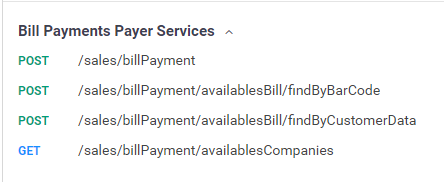
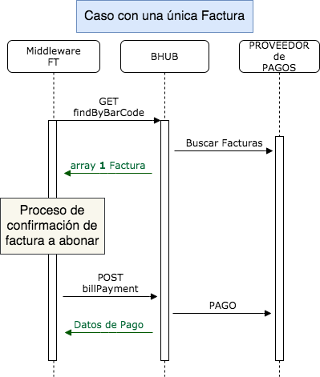
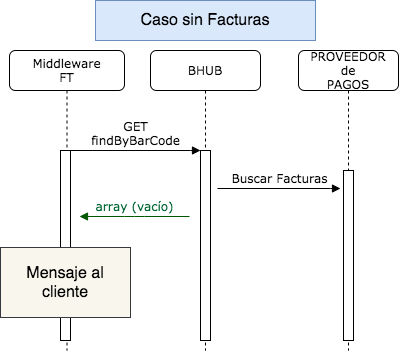
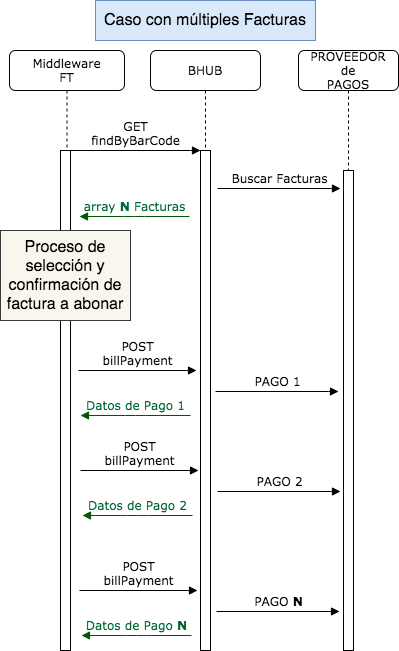

# Pago de Servicios

Objetivo

 

El objetivo de este manual es abordar de una manera simple la implementación de nuestras APIs.

En el recorrido de los distintos ítems que trabajemos, se podrán comprender la integración de las distintas soluciones ofrecidas por la Plataforma OpenPass, para que puedan ser incorporadas a sus productos y servicios ofrecidos.

Introducción

 

El presente documento describe el uso de las APIs de Pago de Servicios de la Plataforma OpenPass. 

 

Todos los servicios expuestos están creados con la finalidad de que se puedan acceder de una manera simple, ágil y unificada independientemente del proveedor con el que se procese la transacción según las reglas de negocio definidas. 

Dado que la Plataforma OpenPass se conecta con diferentes proveedores de servicios de pago y recargas (Rapipago, Pagomiscuentas, CobreExpress, Telerecargas, etc), y cada uno de ellos tiene diferentes procesos, servicios, flujos, criterios y circuitos para realizar las operaciones correspondientes, lo que se hace es unificar y consolidar todos esas diferencias entre los proveedores dentro de la Plataforma OpenPass y se exponen servicios propios del Plataforma. 

Es decir, quien se integra con la Plataforma OpenPass no debe preocuparse por las diferencias entre proveedores, eso lo resuelve todo la Plataforma internamente. Solo debe integrarse con los servicios expuestos por OpenPass y la misma plataforma resuelve cómo interactuar con cada proveedor según sea definido en las reglas de negocio.

Debido a que la Plataforma OpenPass se encuentra en constante evolución, ya sea por mejoras incorporadas, nuevas funcionalidades, cambios normativos y/o cambios en los proveedores y con el afán de lograr una documentación actualizada, los detalles técnicos de cada uno de los métodos y sus atributos se encuentran en la herramienta swagger.

 

**_ https://app.swaggerhub.com/apis/OpenPass-AR/Bhub-FinTech3.0/1.0.0#/_**

Podrán observarse los métodos utilizados por la plataforma para el pago de servicios buscando los endpoints correspondientes a “**_/sales/billPaymen_**t”

 



Resumen

 

_Pagos de Servicios_

 

La Plataforma OpenPass ofrece la posibilidad de realizar, a través de servicios, Pagos de Servicios de tipo:

 


*   Facturas
*   Cupones de Pago
*   Pagos Abiertos
*   Etc.

 

La forma de realizarlo es a través de búsquedas abiertas según lo que ofrece cada Empresa y mediante los diferentes Proveedores de Servicios de Pago que se configuren en la Plataforma. 

Para **Pago de Servicios**, los principales circuitos que podemos mencionar son los siguientes: 


*   **Búsqueda Rápida por Código de Barra**: Se buscar por Código de Barra y se devuelve un Comprobante/s a pagar
*   **Búsqueda por Empresa + Nº de Referencia de pago**: Se busca por Empresa y Nº de Referencia de Pago y se devuelve un Comprobante/s a pagar
*   **Búsqueda por Empresa + Nº de Referencia de pago:**  Se busca por Empresa y Nº de Referencia de Pago y se permite realizar un Pago Abierto según si dicha Empresa lo permite o no.
*   **Búsqueda por Empresa + Id de Cuenta:** Se busca por Empresa y Id de Cuenta y se realiza un Pago 

Cada uno de estos circuitos tiene un flujo distinto y particular, incluso dentro de un mismo circuito pueden definirse flujos diferentes según el servicio a pagar.

1. Consulta de Compañías disponibles.

** **

**_GET /sales/billPayment/availablesCompanies_** 

Tal como se mencionara al comienzo de este documento, la Plataforma OpenPass se conecta con múltiples proveedores de servicios de pago y recargas (Rapipago, Pagomiscuentas, CobreExpress, Telerecargas, etc) y cada uno de ellos, además de tener servicio, flujos y circuitos distintos, también a su vez, tienen convenios con más o menos Compañías receptoras de pagos (por ej: Edenor, Edesur, Metrogas, Personal, Telecom, etc)

Además de trabajar con diferentes Compañías receptoras de pagos, cada proveedor puede tener convenios diferentes, por ej. la empresa Edesur puede permitir Pago Parcial con un proveedor y NO permitirlo con otro. 

Esto genera un sin número de posibilidades y combinación entre la Empresa que se selecciona y el proveedor por el cual se va a transaccionar (esto dependerá de las reglas de negocio definidas en la Plataforma OpenPass, las cuales son 100% configurables desde el BackOffice según defina cada cliente de  la Plataforma)


        **  **

Al igual que con las diferentes opciones en los Servicios de Pago donde la Plataforma OpenPass unifica todos los criterios y resuelve luego internamente, lo mismo hace con las combinaciones de Empresas, Proveedores y convenios de cada uno guardandolas en sus bases de datos para luego, cuando se realiza la búsqueda de una factura para abonar, poder devolver los datos correctos de la Compañía receptora de pagos (Pago Parcial, Pago Voluntario, etc) según el proveedor correspondiente.

Como puede verse en los detalles del método, el servicio devuelve los objetivos _BillCompany_ y dentro del mismo el objeto _BillCategory_.

El método devuelve un objeto denominado _BillCompany_ y dentro del mismo se van a encontrar las particularidades de cada Compañía.

Los principales son: 


*   **allowBillManualPayment**: Este atributo indica si la Empresa a abonar permite abonar una factura mediante una búsqueda por Empresa + Nº de Referencia o solamente por Código de Barra. En este caso puntual, como estamos intentando abonar por lectura de Código de Barra, este atributo no sería de utilidad, de todas maneras, forma parte del objeto devuelto.
*   **allowPartialAmount**: Este atributo indica si la Empresa a abonar permite Pago Parcial, es decir, supongamos que el valor de la factura es de 1000$, el cliente podría decidir pagar solo 600$. Es este caso se debería definir/decidir si se ajusta la UX/UI para que reaccione ante esta posibilidad recibida en el response del llamado a la lectura del Código de Barra.
*   **allowVoluntaryAmount**: Este atributo indica si la Empresa a abonar permite Pago Voluntario, esto significa que se puede hacer un Pago a la Empresa **SIN** esta relacionado a una factura en particular. Sería como un adelanto de dinero a la compañía.
*   **paymentModes**: Son los distintos convenios de pago que tiene el proveedor de servicios con las distintas empresas. Una empresa puede tener **n **convenios de pago asociados al proveedor.
*   **id**: Hace referencia al código de búsqueda del modo de pago asociado a la empresa para el proveedor.
*   **parameters **(dentro de paymentModes): Distintos argumentos de búsqueda para los diferentes convenios, puede tener uno o varios.  \
Provee un objeto con información útil sobre los distintos argumentos:

    **id**: id del argumento \
	**inputType**: **T**=texto,  \
		      **O**=option (normalmente es un array con opciones para un combobox),  \
	                   **N **= numérico \
	**order**: orden de los elementos en la pantalla \
	**length**: longitud de caracteres. \
	**readOnly**: si el campo es solo lectura \
	**optional**: el campo es opcional. \
Toda esta información puede utilizarse para la confección de un formulario en el front para solicitarle al usuario los datos necesarios para una búsqueda por “customerData”


Además del objeto _BillCompany_ también se devuelve el objeto _BillCategory_ dentro del cual se puede encontrar la información de la Categoría (o Rubro) a la cual pertenece la Empresa. En caso de querer agrupar las Compañías receptoras de pago por Categoría, se deberá tomar la información desde este objeto.

Dado que la cantidad de Compañías receptoras de pago puede ser voluminosa, una buena práctica/recomendación sería cachear toda esta información para luego poder utilizarla desde el caché y mejorar la performances y la UX. \
 \
2. Búsqueda por Lectura de Código de Barras.

** **

 

Este servicio permitirá, mediante la lectura de Código de Barra, obtener una lista de facturas a abonar. La lista a obtener puede ser de cero, uno o “n” casos dependiendo siempre de la Empresa a abonar y el Proveedor por el cual se está transaccionando. 

 

Es importante aclarar, que no todas las empresas tienen el tipo de cobranza rápida por medio de un código de barra, en caso de no obtener un resultado se podrá ir por el flujo de buscar la empresa previamente.

 

El servicio al que hay que llamar luego de leer el codigo de barra es:

 

**_POST/sales/billPayment/availablesBill/findByBarCode_**

_ \
_Es necesario enviarle un objeto con datos para identificar la factura. Ya que por código de barras pueden existir colisiones, también se le puede especificar el código de la compañía dentro del mismo objeto como muestra el siguiente ejemplo.


```
{
    "billBarCode": "40504195872028922347421623017849",
    "billCompany": {
            "code": "3145"
        }
}
```


 

El resultado de este método es un array con las facturas disponibles a abonar. Tal como mencionamos antes esto depende de la Empresa abonar y el Proveedor por el cual se esté transaccionando.

Cabe aclarar que si NO existen facturas para abonar o el proveedor NO devuelve nada, el servicio devolverá un código 200 (OK) y el array vacío. 

Dentro de cada ítem del array se devolverá la información relacionada a cada factura disponible para ser abonada. El principal atributo que devuelve este método es el atributo "_externalData_" el cual será utilizado luego para efectivizar el pago de la factura.

Una vez identificada la factura a abonar, se debe llamar al método **_POST /sales/billPayment _**para efectivizar el pago de la factura seleccionada. Tal como mencionamos antes, el atributo a utilizar para identificar de manera particular y unívocamente a la factura a abonar, es mediante el atributo "_externalData" _obtenido previamente mediante el métod_o "findByBarCode"_ (este método se detalla más abajo)

 

**IMPORTANTE**: Destacamos que el parámetro “_companyCode_”, si bien es opcional, en algunas Empresas el mismo es requerido. 

Como parte del response del método se encuentra un objeto denominado _BillCompany_ y dentro del mismo se van a encontrar las particularidades de la Compañía a abonar siendo las siguientes las principales a considerar para la construcción del flujo y/o UX/UI del producto.

Los principales son: 


*   **allowBillManualPayment**: Este atributo indica si la Empresa a abonar permite abonar una factura mediante una búsqueda por Empresa + Nº de Referencia o solamente por Código de Barra. En este caso puntual, como estamos intentando abonar por lectura de Código de Barra, este atributo no sería de utilidad, de todas maneras, forma parte del objeto devuelto.
*   **allowPartialAmount**: Este atributo indica si la Empresa a abonar permite Pago Parcial, es decir, supongamos que el valor de la factura es de 1000$, el cliente podría decidir pagar solo 600$. Es este caso se debería definir/decidir si se ajusta la UX/UI para que reaccione ante esta posibilidad recibida en el response del llamado a la lectura del Código de Barra.
*   **allowVoluntaryAmount**: Este atributo indica si la Empresa a abonar permite Pago Voluntario, esto significa que se puede hacer un Pago a la Empresa **SIN** esta relacionado a una factura en particular. Sería como un adelanto de dinero a la compañía.
*   **openAmount: **Permite saber si la empresa acepta pagos parciales, si está en “false” se debe pagar el valor exacto de la factura.
*   **minAmount: **Mínimo aceptado por el proveedor de la factura
*   **maxAmount: **Máximo aceptado por el proveedor de la factura
*   **requireAditionalData: **Si esta en “true” es posible que el proveedor de la factura necesite/pida más datos para encontrarla
*   **aditionalData: **Debido a que estamos conectados con distintos proveedores de servicios es posible que algunos de ellos necesiten mas datos para encontrar la factura, esos datos van a ser devueltos en este campo en forma de formulario. Estos datos, con sus valores nuevos, son enviados para encontrar la factura en la próxima request.

Además del objeto _BillCompany_ también se devuelve el objeto _BillCategory_ dentro del cual se puede encontrar la información de la Categoría (o Rubro) a la cual pertenece la Empresa a abonar. Esta información es útil para enriquecer la información presentada al usuario previo a la confirmación del pago.


**_<span style="text-decoration:underline;">Diagramas de Flujo</span>_**





En este caso, al no encontrarse ninguna factura a abonar, se deberá ajustar la UX/UI para informarle al cliente que no tiene facturas para abonar o que no se han encontrado facturas a abonar. 





Dentro del "Proceso de selección de factura a abonar" se debe contemplar las diferentes posibilidades según lo detallado previamente (Múltiples Facturas, Pago Parcial, etc)





Dentro del "Proceso de selección de factura a abonar" se debe contemplar las diferentes posibilidades según lo detallado previamente (Múltiples Facturas, Pago Parcial, etc)

Confirmación/Efectivización del Pago.

** **

 

Este servicio permitirá confirmar/efectivizar el pago de una factura previamente identificada mediante cualquiera de los circuitos mencionados anteriormente, ya sea por Lectura de Código de Barra, Empresa + Nº de Referencia, etc.

Para realizar esta acción, se debe llamar al método **_POST /sales/billPayment _**para efectivizar el pago de la factura seleccionada. El atributo a utilizar para identificar de manera particular y unívocamente a la factura a abonar, es mediante el atributo "_externalData" _obtenido previamente mediante cualquiera de los circuitos disponibles.

Dentro del response del método se van a obtener todos los datos de la factura abonada los cuales pueden ser presentados al cliente ya sea en una pantalla y/o comprobante.

 

**NOTA**: En caso que la UX/UI contemple la posibilidad de seleccionar más de una factura a abonar, se debe llamar a este método tantas veces como facturas se deseen abonar con los datos de cada una de las facturas en cada llamado.